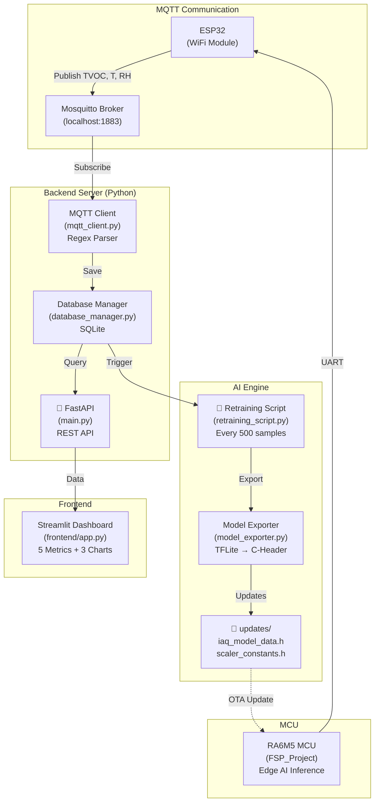
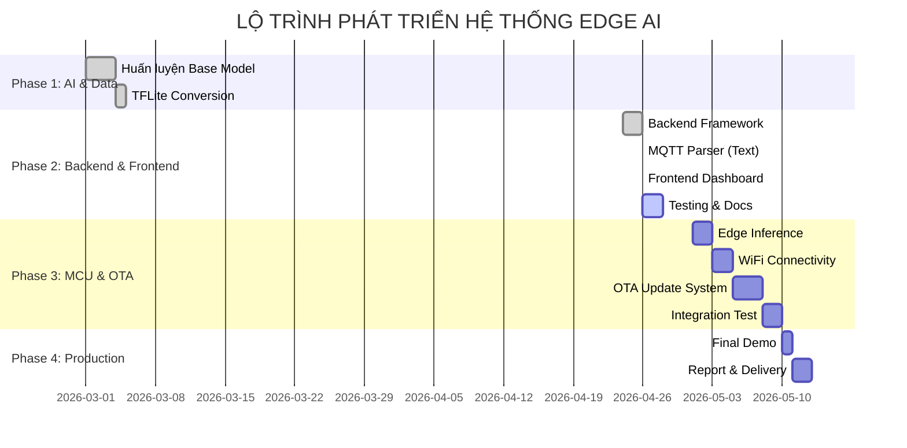
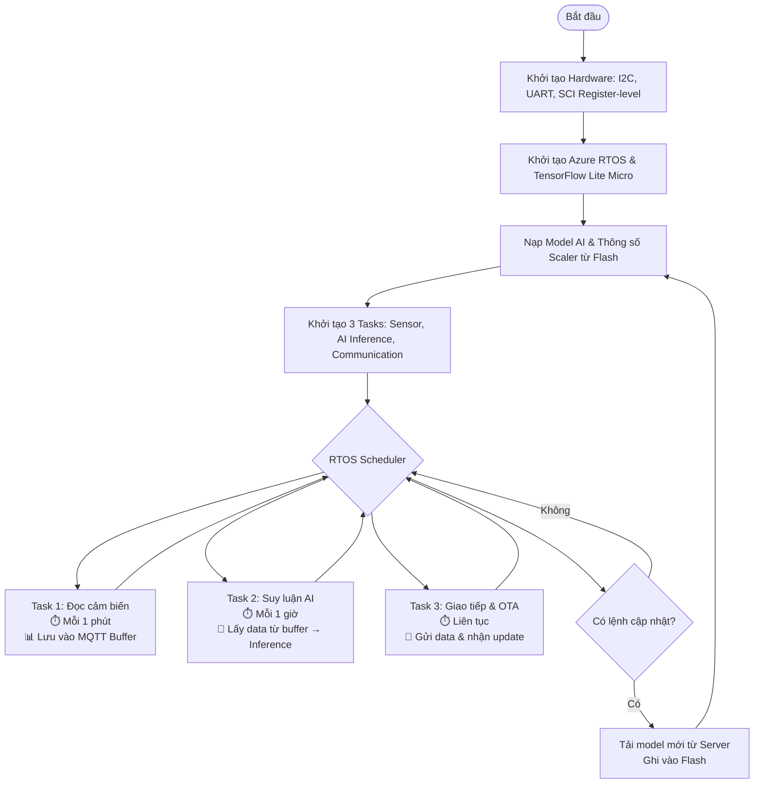
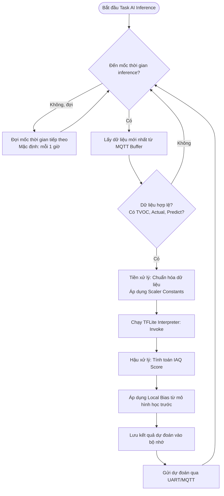
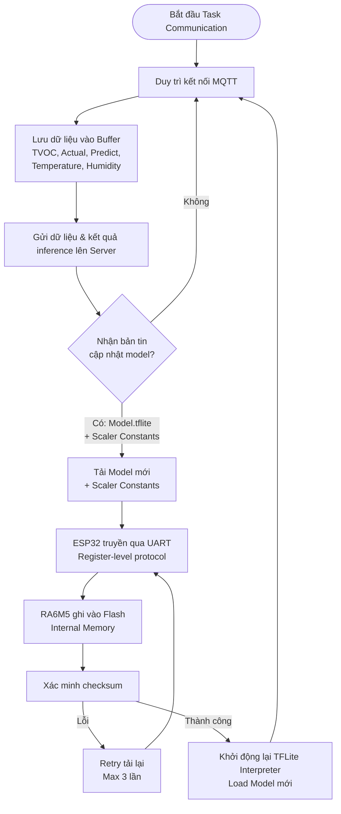

# Edge AI IAQ Prediction System — CK-RA6M5 + ESP32-C6

End-to-end air-quality forecasting pipeline from a Renesas CK-RA6M5 MCU to a
Python server, including automatic model retraining and over-the-air (OTA)
model delivery back to the board.

---

## System Architecture

```
┌──────────────────────────────────────────────────────────────────────────┐
│  Sensor Layer                                                            │
│  ZMOD4410 ──I2C──► CK-RA6M5 (TFLite Micro inference)                    │
│                        │  UART (115200, GPIO17/16)                       │
│                    ESP32-C6 (WiFi bridge + OTA updater)                  │
│                        │  WiFi                                           │
│       ┌────────────────┴────────────────────────┐                       │
│       MQTT broker (port 1883)        FastAPI server (port 8000)          │
│             │                                  │                         │
│       SQLite database               ai_engine/ retraining                │
│             │                                  │                         │
│       Streamlit dashboard           updates/iaq_model.tflite             │
│                                               │                          │
│                                   /api/v1/model/version  ◄─── ESP32 poll│
│                                   /api/v1/model/latest   ◄─── ESP32 DL  │
│                                               │  UART OTA                │
│                                    CK-RA6M5 Data Flash (0x08000000)      │
└──────────────────────────────────────────────────────────────────────────┘
```

### Data flow — normal operation (every 5 s)
1. RA6M5 reads ZMOD4410 (or simulator) → runs TFLite inference
2. RA6M5 prints `"Published: TVOC=…ppb | Actual=… | Predict=…"` over UART
3. ESP32-C6 receives the text line, publishes it to MQTT `iaq/node/data`
4. Server MQTT client parses the payload, saves it to SQLite
5. Every 500 samples the server triggers an incremental retrain (async)
6. Retrained model exported to `updates/iaq_model.tflite`

### Data flow — OTA model update (every 60 s poll)
1. ESP32-C6 polls `GET /api/v1/model/version` → `{"version": <file_size>}`
2. If version differs from last-downloaded value, ESP32 calls `GET /api/v1/model/latest`
3. ESP32 downloads the binary into heap, then sends it to RA6M5 via UART using the CRC-framed protocol (CMD_START / CMD_DATA×N / CMD_END)
4. RA6M5 `fwupdate_receiver` verifies CRC, writes model to Data Flash, writes NVS metadata magic at the last 64-byte block
5. On next reset, `IAQ_Init()` reads the NVS block, detects the valid magic, and loads the model from `0x08000000` instead of the compiled-in fallback

---

## Repository Layout

```
Embedded-Project-main/
├── backend/
│   ├── main.py              FastAPI server (MQTT + API + model serving)
│   ├── mqtt_client.py       MQTT subscriber — parse & store IAQ data
│   └── database_manager.py  SQLite helpers
├── ai_engine/
│   ├── retraining_script.py Incremental fine-tuning (every 500 samples)
│   └── model_exporter.py    H5 → TFLite → C-header converter
├── frontend/
│   └── app.py               Streamlit dashboard
├── updates/                 Auto-generated output of retraining
│   ├── iaq_model.tflite     ← served by /api/v1/model/latest
│   ├── iaq_model_data.h
│   └── scaler_constants.h
└── REQUIREMENT.txt

RENESAS_DRIVER/src/
├── iaq_predictor.cpp        TFLite Micro inference; boots from Data Flash when OTA present
├── scaler_constants.h       Z-score normalisation coefficients
├── iaq_model_data.h         Compiled-in fallback model (used if no OTA received)
└── server_comm.c            RTOS tasks: IAQ loop + fwupdate RX task

RENESAS_DRIVER/Middleware/FWUpdate/
├── fwupdate_receiver.c      UART frame receiver → Data Flash writer + NVS metadata
└── fwupdate_receiver.h      Protocol constants

ESP32C6_SENDER/
└── ESP32C6_SENDER.ino       WiFi bridge + OTA model updater (Arduino)
```

---

## Prerequisites

### Server PC
| Tool | Version |
|---|---|
| Python | ≥ 3.10 |
| Mosquitto MQTT broker | ≥ 2.0 |
| pip packages | see `REQUIREMENT.txt` |

### RA6M5 Board
| Tool | Version |
|---|---|
| CMake | ≥ 3.20 |
| Renesas CC-RL / GCC ARM toolchain | as configured in `CMakeLists.txt` |
| J-Link or E2 debugger | for initial flash |

### ESP32-C6
| Tool | Version |
|---|---|
| Arduino IDE | ≥ 2.x **or** PlatformIO |
| Arduino-ESP32 core | ≥ 3.x (includes `WiFi.h`, `HTTPClient.h`) |
| PubSubClient library | ≥ 2.8 (Nick O'Leary) |

---

## Step 1 — Configure and Start the Server

### 1.1 Install dependencies
```bash
cd Embedded-Project-main
pip install -r REQUIREMENT.txt
```

### 1.2 Start Mosquitto MQTT broker
```bash
# Windows (if installed as service)
net start mosquitto

# Linux / macOS
mosquitto -c /etc/mosquitto/mosquitto.conf -d
```

### 1.3 Start the FastAPI backend
```bash
# From the Embedded-Project-main/ directory
python -m uvicorn backend.main:app --host 0.0.0.0 --port 8000 --reload
```

The server exposes:

| Endpoint | Method | Purpose |
|---|---|---|
| `/` | GET | Health check |
| `/api/v1/latest` | GET | Latest IAQ record |
| `/api/v1/history?limit=N` | GET | Last N records |
| `/api/v1/retrain` | POST | Manually trigger retraining |
| `/api/v1/model/version` | GET | Model version token (file size) |
| `/api/v1/model/latest` | GET | Download TFLite binary |

### 1.4 (Optional) Start the Streamlit dashboard
```bash
streamlit run frontend/app.py
```
Open `http://localhost:8501` in a browser.

---

## Step 2 — Flash the RA6M5 Firmware

### 2.1 Build
```bash
cd RENESAS_DRIVER
cmake -B build -DCMAKE_BUILD_TYPE=Release
cmake --build build
```

### 2.2 Flash
Use the provided script (requires J-Link):
```bash
build_and_flash.bat      # Windows
# or
./build_and_flash.sh     # Linux / macOS
```

The compiled-in model (`src/iaq_model_data.h`) is the fallback used on first
boot. No separate model flash step is required — the OTA pipeline will replace
it at runtime.

### 2.3 UART wiring — RA6M5 ↔ ESP32-C6

| Signal | RA6M5 pin | ESP32-C6 GPIO |
|---|---|---|
| UART TX (IAQ data out) | P302 (UART2 TX) | GPIO16 (RX) |
| UART RX (OTA model in) | P301 (UART2 RX) | GPIO17 (TX) |
| GND | GND | GND |

Baud rate: **115200**, 8N1.

---

## Step 3 — Configure and Flash the ESP32-C6

### 3.1 Edit credentials in `ESP32C6_SENDER.ino`

Open `ESP32C6_SENDER/ESP32C6_SENDER.ino` and edit the user configuration
block near the top:

```cpp
#define WIFI_SSID        "YOUR_WIFI_SSID"
#define WIFI_PASSWORD    "YOUR_WIFI_PASSWORD"
#define SERVER_IP        "192.168.1.100"   // IP of the server PC
```

The `SERVER_IP` must be the IP address of the machine running both
Mosquitto and the FastAPI server.

### 3.2 Install the PubSubClient library

Arduino IDE: **Sketch → Include Library → Manage Libraries** → search
`PubSubClient` by Nick O'Leary → Install.

### 3.3 Flash the ESP32-C6

- Board: **ESP32C6 Dev Module**
- Partition scheme: default (no OTA partition required — the model is pushed directly to RA6M5)
- Upload via USB-CDC or JTAG

### 3.4 Expected Serial Monitor output

```
[BOOT] ESP32-C6 IAQ Bridge & OTA Updater
[WiFi] Connecting to "MyNetwork"..........
[WiFi] Connected — IP: 192.168.1.105
[MQTT] Connecting to 192.168.1.100:1883 ...
[MQTT] Connected
[BOOT] Ready — bridging RA6M5 UART to MQTT
[Bridge→MQTT] Published: TVOC=144.0ppb | Actual=1.86 | Predict=1.80
[OTA] Version check HTTP 200
[OTA] Model up to date
```

When a retrain completes:
```
[OTA] New model detected (server=4612, local=4456)
[OTA] Downloading model binary from server...
[OTA] Downloaded 4612 bytes — sending to RA6M5...
[OTA] Progress: 128 / 4612 bytes
...
[OTA] Transfer complete — RA6M5 verified and written to Data Flash
```

---

## Step 4 — Verify End-to-End Operation

### 4.1 Check data is reaching the database
```bash
curl http://localhost:8000/api/v1/latest
```
Expected response:
```json
{
  "id": 42,
  "timestamp": "2026-05-11 09:15:00",
  "tvoc": 144.0,
  "iaq_actual": 1.86,
  "iaq_forecast": 1.80,
  "temperature": 31.1,
  "humidity": 46.9
}
```

### 4.2 Manually trigger retraining (for testing without 500 samples)
```bash
curl -X POST http://localhost:8000/api/v1/retrain
```

### 4.3 Verify a new model is available
```bash
curl http://localhost:8000/api/v1/model/version
# {"version": 4612}
```

### 4.4 Confirm RA6M5 loaded the OTA model
After the ESP32 completes the OTA push and the RA6M5 is reset, the debug
UART will print:
```
IAQ: using OTA model from Data Flash (4612 bytes)
[IAQ Task] Init OK. Starting 5s forecast loop...
```
If no OTA has been received yet:
```
IAQ: using built-in model (4456 bytes)
```

---

## OTA Model Persistence (NVS Mechanism)

The RA6M5 Data Flash (8 KB at `0x08000000`) is laid out as follows:

```
0x08000000  ┌─────────────────────────┐
            │  OTA model binary       │  up to 8128 bytes
            │  (written by fwupdate)  │
0x08001FC0  ├─────────────────────────┤
            │  NVS metadata block     │  64 bytes (last block)
            │  [0..3]  0xDEADBEEF    │  ← valid-model magic
            │  [4..7]  model_len      │
            │  [8..9]  model_crc16    │
            │  [10..63] 0xFF          │
0x08002000  └─────────────────────────┘
```

- On successful OTA: `fwupdate_receiver` writes the NVS block.
- On every reset: `IAQ_Init()` reads `0x08001FC0`, checks the magic, and
  uses the Data Flash pointer if valid — otherwise falls back to the
  compiled-in model in Code Flash.
- The old model is automatically overwritten by the next OTA transfer
  (CMD_START erases the model region before writing).

---

## Troubleshooting

| Symptom | Likely cause | Fix |
|---|---|---|
| ESP32 prints `[OTA] Version check HTTP -1` | Server not reachable | Verify `SERVER_IP` and firewall allow port 8000 |
| ESP32 prints `[MQTT] Failed (state=-2)` | Broker not running or wrong IP | Start Mosquitto; check `SERVER_IP` |
| RA6M5 prints `IAQ AllocateTensors() failed` | Retrained model is larger than `kTensorArenaSize` | Increase `kTensorArenaSize` in `iaq_predictor.cpp` and rebuild |
| OTA `CMD_END → NACK` (reason 0x06) | Image CRC mismatch | WiFi packet loss during download — retry automatically on next 60 s poll |
| Data Flash erase fails (NACK reason 0x03) | Flash still in read mode | Ensure `flash_hp_init()` is called before erase (handled internally) |
| Dashboard shows no data | MQTT parser regex not matching | Confirm RA6M5 debug output format contains `"Published:"` |

## 📌 Mô Tả Dự Án

Hệ thống **Edge AI** dự đoán **chỉ số IAQ (Indoor Air Quality)** theo chuẩn **UBA** (1.0-5.0) sử dụng:
- **Cảm biến**: ZMOD4410 (CO2, VOC)
- **Chip MCU**: CK-RA6M5 (Edge AI Inference)
- **Backend**: FastAPI + MQTT + SQLite
- **Frontend**: Streamlit Dashboard
- **MLOps**: Tự động học lại model từ dữ liệu thực tế

---

## ✨ Các Cập Nhật Mới Nhất (April 2026)

### 🔄 MQTT Data Processing Pipeline
- ✅ **Parser text-based** thay vì JSON
- ✅ **Extract fields**: TVOC, IAQ Actual, IAQ Predict, Temperature, Humidity
- ✅ **Regex patterns** để parse data từ ESP32 format

### 📊 Database Schema Enhanced
- ✅ **Thêm columns**: `temperature`, `humidity`
- ✅ **Auto migration** cho database cũ
- ✅ **Remove unused**: `eco2` column

### 📈 Frontend Dashboard Improved
- ✅ **5 metrics**: TVOC, IAQ Actual, MAE, Temperature, Humidity
- ✅ **3 biểu đồ**: IAQ Trend, TVOC Timeline, Environment Metrics
- ✅ **UBA Color zones** (Xanh→Đỏ)

### 🧪 Testing & Documentation
- ✅ **Unit tests**: `test_mqtt_pipeline.py`
- ✅ **Auto test commands**: `send_mqtt_test.ps1`
- ✅ **Complete guides**: MQTT_DATA_PROCESSING.md, TEST_GUIDE.md, QUICK_START.md

---

## 🔄 MQTT Data Processing Workflow

```
┌─────────────────────────────────────────────────────────────────┐
│                    ESP32 gửi dữ liệu MQTT                       │
│  [547034 ms] Published: TVOC=144.0ppb | Actual=1.86 | Predict=1.80
│  [548171 ms] [sensor:263] T=31.1 C  RH=46.9%                    │
└─────────────────────────────────────────────────────────────────┘
                              ↓
┌─────────────────────────────────────────────────────────────────┐
│         MQTT Client (backend/mqtt_client.py)                     │
│  • Subscribe: iaq/node/data                                      │
│  • Parse với Regex Patterns                                      │
│    - TVOC=(\d+\.?\d*)\s*ppb                                      │
│    - Actual=(\d+\.?\d*)                                          │
│    - T=(\d+\.?\d*)\s*C                                           │
│    - RH=(\d+\.?\d*)%                                             │
│  • Validate: đủ TVOC, Actual, Predict?                           │
│  • Cache: latest temperature/humidity                            │
└─────────────────────────────────────────────────────────────────┘
                              ↓ (Dữ liệu hợp lệ)
┌─────────────────────────────────────────────────────────────────┐
│     Database Manager (backend/database_manager.py)               │
│  • Save to SQLite: air_quality_logs                              │
│    - timestamp, tvoc, iaq_actual, iaq_forecast                   │
│    - temperature, humidity                                       │
│  • Auto migration (thêm columns nếu cần)                         │
│  • Count samples (check trigger retrain at 500)                  │
└─────────────────────────────────────────────────────────────────┘
                              ↓
┌─────────────────────────────────────────────────────────────────┐
│              Trigger Checks & Processing                         │
├─────────────────────┬─────────────────┬─────────────────────────┤
│  Check Retrain      │   API Handler   │  Frontend Update        │
│  (500 samples?)     │   /api/v1/      │  (Streamlit refresh)    │
│  ↓ YES              │   latest        │  ↓                      │
│  Start Retraining   │   history       │  Dashboard shows:       │
│  (async thread)     │                 │  • Metrics              │
│                     │                 │  • Charts & Trends      │
└─────────────────────┴─────────────────┴─────────────────────────┘
                              ↓
┌─────────────────────────────────────────────────────────────────┐
│      AI Engine Retraining (ai_engine/retraining_script.py)       │
│  (Triggered every 500 samples)                                   │
│  • Extract data from database                                    │
│  • Normalize: StandardScaler                                     │
│  • Fine-tune: Epochs=15, LR=0.0001                               │
│  • Export: TFLite + C-Header (updates/)                          │
│  • Ready for OTA update to MCU                                   │
└─────────────────────────────────────────────────────────────────┘
```

---

## 📁 Cấu Trúc Dự Án

```
Embedded-Project/
├── 🎯 Core Files
│   ├── backend/
│   │   ├── mqtt_client.py          ✨ UPDATED: Regex parser
│   │   ├── database_manager.py     ✨ UPDATED: New schema
│   │   ├── main.py                 FastAPI server
│   │   ├── hardware_simulate.py    MQTT data simulator
│   │   └── iaq_history.db          SQLite database
│   │
│   ├── frontend/
│   │   └── app.py                  ✨ UPDATED: 5 metrics + 3 charts
│   │
│   ├── ai_engine/
│   │   ├── retraining_script.py    Auto retraining
│   │   └── model_exporter.py       TFLite → C-Header
│   │
│   ├── updates/                    Model outputs
│   │   ├── IAQ_model.h5
│   │   ├── iaq_model.tflite
│   │   ├── iaq_model_data.h
│   │   └── scaler_constants.h
│   │
│   ├── API_call_model/             C++ model inference
│   │   ├── iaq_predictor.cpp
│   │   └── iaq_predictor.h
│   │
│   └── FSP_Project/                RA6M5 firmware
│       ├── src/
│       ├── ra_gen/
│       └── CMakeLists.txt
│
├── 📚 Documentation (NEW)
│   ├── QUICK_START.md              🚀 Bắt đầu nhanh 5 phút
│   ├── MQTT_DATA_PROCESSING.md     📡 Chi tiết quy trình
│   ├── TEST_GUIDE.md               🧪 Hướng dẫn test
│   ├── DETAILED_CHANGES.md         🔍 So sánh trước/sau
│   ├── CHANGES_SUMMARY.md          📝 Tóm tắt cập nhật
│   └── README.md                   📖 File này
│
└── 🧪 Test Files (NEW)
    ├── test_mqtt_pipeline.py       Unit tests
    ├── send_mqtt_test.ps1          Auto test (Windows)
    ├── test_mqtt_commands.ps1      Interactive test
    └── test_mqtt_commands.sh       Test commands (Linux)
```

---

## 🚀 Quick Start (5 Phút)

### ✅ Yêu Cầu
- Python 3.8+
- Mosquitto Broker
- Virtual environment activated

### 📋 Bước 1: Khởi Động Mosquitto (MQTT Broker)

**Terminal 1:**
```powershell
mosquitto -p 1883
```

**Output:**
```
1629829264: mosquitto version 2.0.14 starting
1629829264: Using default config from C:\Program Files\mosquitto\mosquitto.conf
1629829264: Opening ipv4 listen socket on port 1883
```

### 📋 Bước 2: Khởi Động Backend Server

**Terminal 2:**
```powershell
python -m backend.main
```

**Output:**
```
🚀 Khởi tạo Database...
📡 Đang khởi động MQTT Client Service...
✅ MQTT Connected to Broker
INFO:     Uvicorn running on http://0.0.0.0:8000
```

### 📋 Bước 3: Khởi Động Frontend Dashboard

**Terminal 3:**
```powershell
streamlit run frontend/app.py
```

**Output:**
```
Local URL: http://localhost:8501
```

Trình duyệt sẽ tự động mở. Bạn sẽ thấy dashboard trống (chờ dữ liệu).

### 📋 Bước 4: Gửi Test MQTT Messages

**Terminal 4:**
```powershell
.\send_mqtt_test.ps1
```

**Output Terminal 4:**
```
===== MQTT Test Messages =====
Test 1: Send TVOC + IAQ data
Sent: [547034 ms] Published: TVOC=144.0ppb | Actual=1.86 | Predict=1.80
Test 2: Send Temperature + Humidity
Sent: [548171 ms] [sensor:263] T=31.1 C  RH=46.9%
...
===== All tests sent! =====
```

**Output Terminal 2 (Backend):**
```
📨 Raw MQTT: [547034 ms] Published: TVOC=144.0ppb | Actual=1.86 | Predict=1.80
✅ Parsed: {'tvoc': 144.0, 'iaq_actual': 1.86, 'iaq_forecast': 1.80}
✅ Saved: TVOC=144.0ppb, Actual=1.86, Predict=1.80
```

**Terminal 3 (Dashboard):** Sẽ hiển thị metrics + charts 📊

---

## 📊 MQTT Data Format

### Input Format (từ ESP32)

```
[547034 ms] Published: TVOC=144.0ppb | Actual=1.86 | Predict=1.80
[548171 ms] [sensor:263] T=31.1 C  RH=46.9%
[552043 ms] [IAQ_Predict OK]
```

### Extract Fields

| Field | Regex Pattern | Example | Range |
|-------|---------------|---------|-------|
| **TVOC** | `TVOC=(\d+\.?\d*)\s*ppb` | 144.0 | 0-5000 ppb |
| **IAQ Actual** | `Actual=(\d+\.?\d*)` | 1.86 | 1.0-5.0 (UBA) |
| **IAQ Predict** | `Predict=(\d+\.?\d*)` | 1.80 | 1.0-5.0 (UBA) |
| **Temperature** | `T=(\d+\.?\d*)\s*C` | 31.1 | -40 to 85 °C |
| **Humidity** | `RH=(\d+\.?\d*)%` | 46.9 | 0-100 % |

### Database Schema

```sql
CREATE TABLE air_quality_logs (
    id INTEGER PRIMARY KEY AUTOINCREMENT,
    timestamp DATETIME,           -- "2024-04-26 10:30:45"
    tvoc REAL,                    -- 144.0 ppb
    iaq_actual REAL,              -- 1.86 (UBA)
    iaq_forecast REAL,            -- 1.80 (UBA)
    temperature REAL,             -- 31.1 °C (NEW)
    humidity REAL                 -- 46.9 % (NEW)
);
```

---

## 📈 System Architecture



---

## 🧪 Testing

### Run Unit Tests
```powershell
python test_mqtt_pipeline.py
```

**Output:**
```
✅ Pattern 'TVOC=(\d+\.?\d*)\s*ppb' matches 'TVOC=144.0ppb' = 144.0
✅ Valid payload contains all required fields: True
✅ ALL TESTS PASSED!
```

### Check Database
```powershell
sqlite3 backend/iaq_history.db
SELECT * FROM air_quality_logs ORDER BY id DESC LIMIT 5;
```

### API Endpoints
```powershell
# Latest record
curl http://localhost:8000/api/v1/latest

# History (100 records)
curl http://localhost:8000/api/v1/history?limit=100
```

---

## 🎯 IAQ UBA Rating Levels

| Level | Range | Color | Meaning |
|-------|-------|-------|---------|
| **1** | 1.0-1.9 | 🟢 Green | Very Good |
| **2** | 1.9-2.9 | 🟡 Yellow-Green | Good |
| **3** | 2.9-3.9 | 🟡 Yellow | Fair |
| **4** | 3.9-4.9 | 🟠 Orange | Poor |
| **5** | 4.9-5.0 | 🔴 Red | Very Poor |

---

## 📚 Documentation

| File | Purpose |
|------|---------|
| **QUICK_START.md** | 🚀 Bắt đầu nhanh 5 phút |
| **MQTT_DATA_PROCESSING.md** | 📡 Chi tiết quy trình MQTT |
| **TEST_GUIDE.md** | 🧪 Hướng dẫn test toàn bộ |
| **DETAILED_CHANGES.md** | 🔍 Chi tiết so sánh trước/sau |
| **CHANGES_SUMMARY.md** | 📝 Tóm tắt cập nhật |

---

## 🔧 Troubleshooting

| Issue | Solution |
|-------|----------|
| Connection refused | Chắc chắn Mosquitto đang chạy: `mosquitto -p 1883` |
| MQTT not parsing | Kiểm tra log Terminal 2, chạy tests: `python test_mqtt_pipeline.py` |
| Database locked | Xóa lock files: `rm backend/iaq_history.db-wal` |
| Port 8501 busy | Dùng port khác: `streamlit run frontend/app.py --server.port 8502` |
| Module not found | Cài packages: `pip install -r REQUIREMENT.txt` |

---

## 📊 Performance Metrics

| Metric | Value | Notes |
|--------|-------|-------|
| MQTT Parse Time | ~1ms | Regex patterns |
| Database Insert | ~5ms | SQLite |
| API Response | <100ms | Simple queries |
| Dashboard Refresh | 3s | Streamlit polling |
| Model Inference | ~50ms | TFLite on RA6M5 |
| Retrain Trigger | Every 500 samples | ~25 minutes |

---

## 📝 Development Timeline



---

## 👥 Team & License

- **Developed by**: IoT & Edge AI Lab
- **License**: MIT
- **Last Updated**: April 26, 2026

---

## 📞 Support & Contact

Nếu gặp vấn đề:
1. ✅ Kiểm tra file tài liệu tương ứng
2. ✅ Chạy unit tests để debug
3. ✅ Xem logs trong terminal
4. ✅ Tham khảo TEST_GUIDE.md

---

**Happy coding! 🚀**

    - Khối Dashboard: Hiển thị số liệu thực tế, kết quả dự báo và trạng thái cập nhật của mô hình AI.

Lưu đồ giải thuật tổng quát:



Lưu đồ task AI Inference (Edge AI)
Đây là trọng tâm xử lý của model AI trên MCU RA6M5, nhằm suy luận IAQ dựa trên dữ liệu cảm biến.



Lưu đồ Task Cập nhật model (OTA)
Cập nhật model mới sau khi huấn luyện tăng cường trên Server thông qua MQTT.




Cấu trúc thư mục:

```
IAQ_EdgeAI_Dashboard/
├── backend/                # Xử lý dữ liệu và kết nối Kit
│   ├── main.py             # FastAPI App khởi tạo server
│   ├── mqtt_client.py      # Lắng nghe dữ liệu từ ESP32 gửi lên
│   ├── database_manager.py # Quản lý InfluxDB/SQLite lưu lịch sử cảm biến
│   └── api/                # Các endpoint trả về dữ liệu cho Dashboard
├── frontend/               # Giao diện người dùng
│   ├── app.py              # Streamlit dashboard hiển thị biểu đồ
│   └── components/         # Các widget (gauge, line chart)
├── ai_engine/              # "Lò luyện" AI trên Server
│   ├── retraining_script.py# Script lấy data từ DB để học tăng cường
│   ├── model_exporter.py   # Chuyển đổi .h5 sang .tflite và Header .h
│   └── vault/              # Nơi lưu trữ các version của model (v1, v2...)
├── updates/                # Thư mục chứa file binary để ESP32 tải về (OTA)
│   └── iaq_model_latest.bin
├── requirements.txt        # Các thư viện cần thiết (FastAPI, paho-mqtt, tensorflow)
└── docker-compose.yml      # (Tùy chọn) Chạy nhanh InfluxDB và Grafana
```

Sơ đồ kết nối hệ thống với RA6M5 và ESP32

```

[ Cảm biến ZMOD4410 ]
        │
        ▼
[ Kit Renesas CK-RA6M5 ]
        │  (UART/SPI/I2C)
        ▼
[ ESP32 (Wi-Fi) ]
        │  (Wi-Fi)
        ▼
[ Server / Cloud ]
        ├── Giám sát dữ liệu IAQ
        └── Phân tích & dự đoán

```